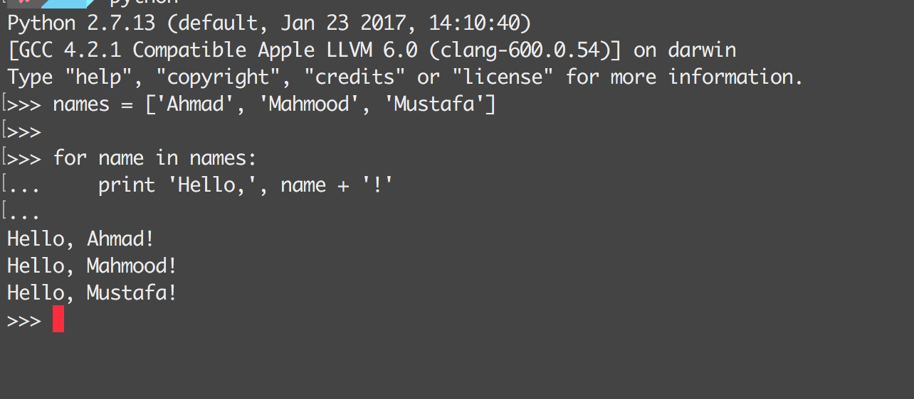

<!-- $theme: default -->

A Developer's Life after University
===

###### Life and pre-career of a software developer in University

##
##
##
##
##
##
##

##### Mustafa Ehsan 
Website: https://mustafaaloko.github.io
GitHub: [@mustafaaloko](https://github.com/mustafaaloko)
Twitter: [@mustafaaloko](https://twitter.com/mustafaaloko)

###### September 2017

---
<!-- page_number: true -->
# Don't get upset with your black screen

- Loops, blocks, assignments, if...else, black screens will always be there, master them.
- From building a simple calculator to writing code for NASA's spaceships your loops and if, elses will be always be with you.

# 

---

# What good will data structures and algorithms bring to you?

- Is there any good in it?
- Logic and decision making
- Big companies interviews
- Reducing complexity
---

# Personality Tips

- If you cannot answer your "why?", don't go forward
- Sometimes, don't listen to your family; ask them why?
- If you love it, you will get it
- Don't let university kill you
- Go out and enjoy your time
---

# Things to start from today

- Build small things, but usable things
- Start automation from today, start with ugly scripts
- Reinvent the wheel as much as you can

---

# Pre-career Tips

- Be a specialist, be a generalist
- Have something to show
- Be fair and realistic about your incomes
- Decide with your current state in mind
- Ge involved with open source (long term tip)
---

# Open Source Involvement

- You will learn, a whole lot
- You will be peer with industry's bests
- Learning the best possible practices in a technology
- It can even help you make a lot of money
- It can help you start a business out of it
---

# Some open source maintainers stories...

---
# Taylor Otwell's Story
To be filled...

---
# Mohamed Said's Story
To be filled...

---

# Some good resources
To be filled...

---

# 
Thank you! :+1:

